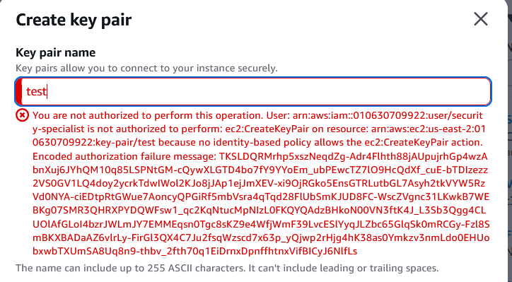
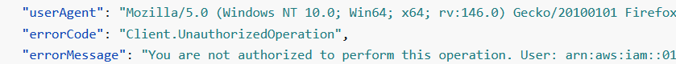
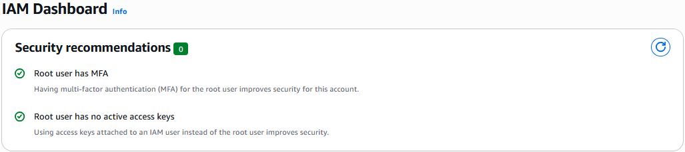

# Day 4: IAM Governance & Identity Remediation

## Overview

In this lab, I performed a security audit of an AWS environment to identify identity-based risks. I implemented **Role-Based Access Control (RBAC)** and enforced the **Principle of Least Privilege (PoLP)** to secure the infrastructure against unauthorized access.

---

## Objective

The objective of this lab was to:

- Identify identity-based security risks in AWS IAM configuration
- Implement RBAC to replace root account usage
- Enforce the Principle of Least Privilege through IAM policies
- Enable Multi-Factor Authentication (MFA) for all privileged accounts
- Validate security controls through negative testing and audit logging

---

## Identification

### Initial Security Assessment

During the security audit, several identity-based vulnerabilities were identified:

#### **Vulnerability 1: Root Account Usage**
- **Issue:** Root account being used for routine operations
- **Risk Level:** Critical
- **Impact:** Root account has unrestricted access to all AWS services and resources

#### **Vulnerability 2: Missing MFA**
- **Issue:** No Multi-Factor Authentication enabled for privileged accounts
- **Risk Level:** Critical
- **Impact:** Accounts vulnerable to credential compromise

#### **Vulnerability 3: Overly Permissive Access**
- **Issue:** IAM users with excessive permissions
- **Risk Level:** High
- **Impact:** Violation of Principle of Least Privilege

---

## Remediation

### 1. RBAC Implementation

**Action:** Created a `Security_Auditors` IAM group with restricted permissions and migrated from Root account usage to a restricted IAM user.

**Implementation Steps:**
1. Created IAM group: `Security_Auditors`
2. Attached read-only and audit-specific policies
3. Created IAM user and added to `Security_Auditors` group
4. Discontinued root account usage for routine operations

**Result:** 
- Root account protected from routine use
- IAM users operate with least privilege
- Role-based access control established

### 2. MFA Enforcement

**Action:** Enabled Virtual Multi-Factor Authentication (MFA) for both Root and IAM users.

**Implementation:**
- Configured TOTP-based MFA using Google Authenticator
- Enforced MFA for all privileged accounts
- Verified 100% MFA coverage

**Result:**
- All privileged accounts protected with MFA
- Defense-in-depth security control implemented
- Compliance with AWS security best practices

### 3. Policy Enforcement

**Action:** Implemented IAM policies that explicitly deny unauthorized management actions.

**Result:**
- Unauthorized actions are blocked at the policy level
- All denied actions are logged in CloudTrail
- Principle of Least Privilege enforced

---

## Validation

### Negative Control Testing

To verify the effectiveness of the security controls, **negative testing** was performed:

#### **Test 1: Unauthorized Key Pair Creation**

**Action:** Attempted to create an EC2 Key Pair as a restricted `Security_Auditors` group member.

**Expected Result:** Access Denied

**Actual Result:** **Access Denied** - Policy correctly blocked the unauthorized action

**Evidence:**
- Console error received when attempting unauthorized action
- CloudTrail log shows `AccessDenied` error code for `CreateKeyPair` event

#### **Test 2: CloudTrail Logging Verification**

**Action:** Reviewed CloudTrail logs to verify that denied actions are properly logged.

**Result:** **Verified** - All unauthorized attempts are logged with `AccessDenied` error codes

#### **Test 3: MFA Status Verification**

**Action:** Verified MFA status in IAM Dashboard.

**Result:** **100% MFA Coverage** - All privileged accounts have MFA enabled

---

## Audit Evidence

Below are the technical artifacts proving the effectiveness of the security controls implemented.

### 1. Unauthorized Action Failure (Negative Test)

  
<b>Click to view: Console Error - Unauthorized Key Pair Creation</b>

  

    
     
    <i>Console error received when attempting to create a Key Pair as a restricted Auditor.</i>
  

### 2. CloudTrail Log Verification

  
<b>Click to view: CloudTrail Access Denied Log</b>

  

    
     
    <i>Evidence in CloudTrail showing the "AccessDenied" error code for the unauthorized CreateKeyPair event.</i>
  

### 3. Compliance Remediation (MFA Status)

  
<b>Click to view: MFA Coverage Verification</b>

  

    
     
    <i>IAM Dashboard showing 100% MFA coverage for privileged accounts.</i>
  

---

## Key Findings & Results

| Control | Before | After | Status |
| :--- | :--- | :--- | :--- |
| **Root Account Usage** | Active for routine operations | Protected, IAM users used | Remediated |
| **MFA Coverage** | 0% | 100% | Complete |
| **RBAC Implementation** | Not implemented | `Security_Auditors` group created | Implemented |
| **Policy Enforcement** | Permissive | Least Privilege enforced | Hardened |
| **Audit Logging** | Not verified | CloudTrail verified | Validated |

---

## Tools Used

- **AWS IAM:** For identity governance and policy management
- **AWS CloudTrail:** For security logging and event auditing
- **Google Authenticator:** For TOTP MFA implementation
- **AWS Console:** For policy configuration and verification

---

## Reflection

### Key Learnings

1. **RBAC Implementation:** Created a `Security_Auditors` group and migrated from Root account usage to a restricted IAM user. This demonstrates proper identity governance and reduces the risk of accidental or malicious actions.

2. **Negative Control Testing:** Verified that unauthorized management actions (e.g., `CreateKeyPair`) were explicitly denied and logged. This validates that security policies are working as intended and provides audit trails for compliance.

3. **MFA Enforcement:** Remediated critical security gaps by enabling Virtual Multi-Factor Authentication (MFA) for both Root and IAM users. MFA provides defense-in-depth protection against credential compromise.

4. **SysAdmin:** By moving operations to IAM users, we reduce the risk of accidental resource deletion and ensure that every administrative action is tied to a specific identity for accountability. 

### Security Best Practices Applied

- **Principle of Least Privilege:** IAM users granted only necessary permissions
- **Defense in Depth:** Multiple security controls (RBAC, MFA, policies)
- **Audit Logging:** All actions logged in CloudTrail for compliance
- **Negative Testing:** Verified controls work by testing unauthorized actions
- **Root Account Protection:** Root account secured and not used for routine operations

---

## Related Resources

- [AWS IAM Best Practices](https://docs.aws.amazon.com/IAM/latest/UserGuide/best-practices.html)
- [AWS CloudTrail Documentation](https://docs.aws.amazon.com/awscloudtrail/)
- [CIS AWS Foundations Benchmark - IAM](https://www.cisecurity.org/benchmark/amazon_web_services)
- [AWS MFA Documentation](https://docs.aws.amazon.com/IAM/latest/UserGuide/id_credentials_mfa.html)

---

## Lab Metadata

- **Lab Date:** Day 4
- **Focus Area:** IAM Governance & Identity Management
- **AWS Services:** IAM, CloudTrail
- **Compliance:** CIS AWS Foundations Benchmark
- **Status:** Complete

---

**Next Steps:** Continue implementing IAM policies for additional services, set up IAM Access Analyzer for continuous monitoring, and implement session management policies.
