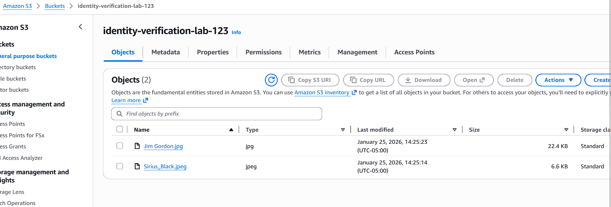
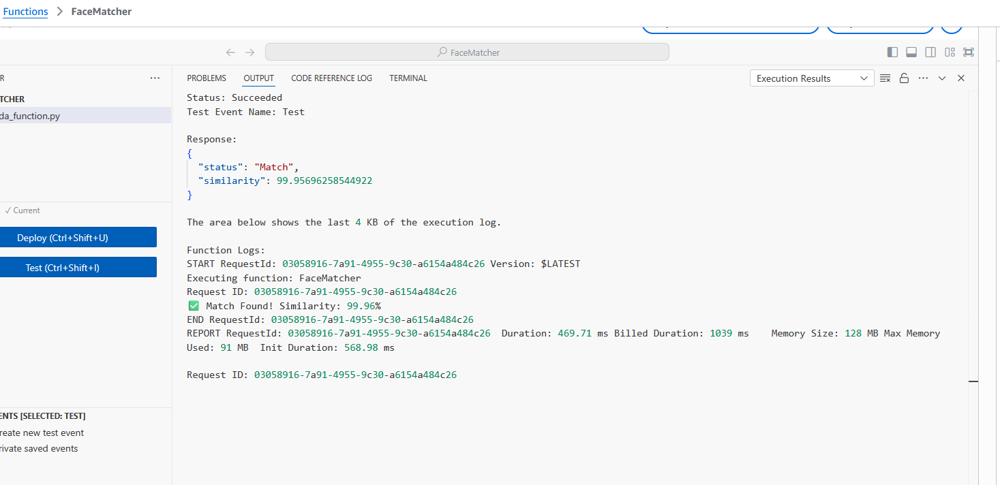

# AWS Serverless Facial Comparison System

Facial comparison and biometric matching using AWS Rekognition on a serverless architecture.

## Overview

This project demonstrates a serverless AI pipeline that performs biometric face comparison using **Amazon Rekognition**. The system compares a reference image against a target image to determine if they contain the same individual, providing a mathematical similarity score.

## Architecture

### Technology Stack

| Component | Technology |
|-----------|-----------|
| **Storage** | Amazon S3 (Standard Storage) |
| **Compute** | AWS Lambda (Python 3.x) |
| **AI Service** | Amazon Rekognition (CompareFaces API) |
| **Security** | IAM (Identity & Access Management) |
| **Monitoring** | Amazon CloudWatch Logs |

## Project Components

### 1. Data Source (S3)

Images are stored in an S3 bucket, consisting of:
- A clear reference headshot (source image)
- A secondary "challenge" photo (target image)

### 2. IAM Security & Permissions

Following the principle of least privilege, the Lambda execution role is granted specific access:

| Policy | Purpose |
|--------|---------|
| `AmazonRekognitionFullAccess` | Access to Rekognition APIs |
| `AmazonS3ReadOnlyAccess` | Read access to S3 objects |

### 3. Lambda Function

The Python function uses the Boto3 SDK to invoke the `compare_faces` operation. Request metadata is extracted from the Lambda context object for professional logging.

## Testing & Results

### Key Findings

- **Similarity Threshold:** 80% (to account for biometric variance)
- **Result:** Successfully identified facial matches
- **Traceability:** Each request tracked using unique `aws_request_id`

### CloudWatch Monitoring

Comprehensive logging enables audit trails for AI decisions and troubleshooting of access errors.

## Cleanup

To maintain cost efficiency, the following cleanup steps were performed:

1. Emptied and deleted the S3 bucket
2. Deleted the Lambda function
3. Removed the associated IAM role and CloudWatch log groups