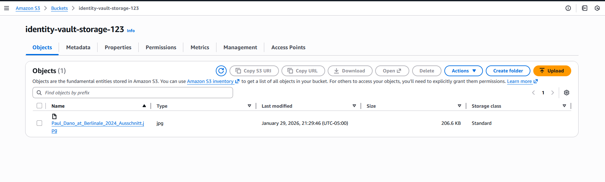
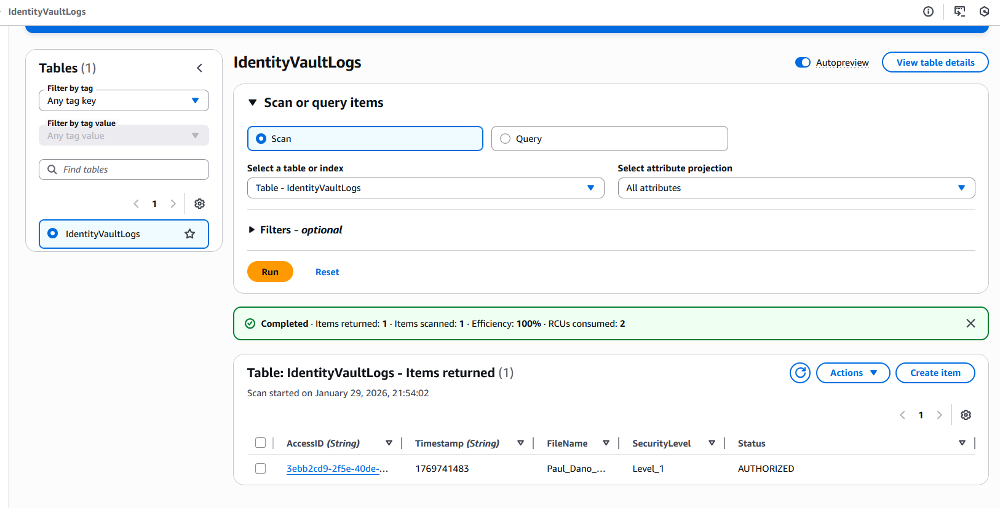
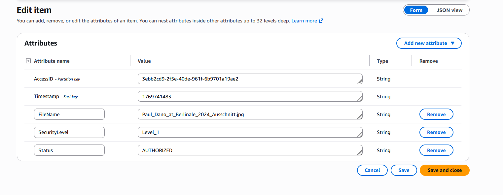
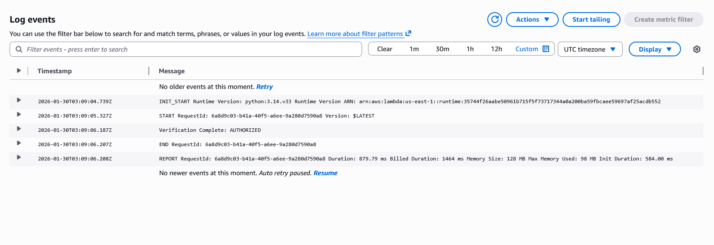

# Day 13: Biometric Logger

A serverless biometric identity vault proof-of-concept on AWS. Demonstrates event-driven image processing, face analysis via Amazon Rekognition, and immutable audit logging with DynamoDB.

## Quick Links

- [Overview](#overview)
- [Architecture](#architecture)
- [How It Works](#how-it-works)
- [Technical Challenges](#technical-challenges)
- [Security](#security)
- [Testing](#testing)

## Overview

This project showcases:

- **Event-driven processing**: S3 uploads trigger Lambda functions instantly
- **Face analysis**: Amazon Rekognition extracts biometric data and confidence scores
- **Immutable audit trail**: Every verification attempt logged to DynamoDB with timestamp
- **Zero-exposure design**: Fully serverless, no persistent instances

## Architecture

| Layer | Service | Role |
|-------|---------|------|
| **Storage** | Amazon S3 | Image uploads & event triggers |
| **Compute** | AWS Lambda (Python 3.12) | Event processing & orchestration |
| **AI/ML** | Amazon Rekognition | Face detection & confidence analysis |
| **Audit** | Amazon DynamoDB | Immutable verification ledger |

All components follow least-privilege IAM principles with encryption at rest.

## How It Works

### 1. Image Upload (S3 Trigger)

Upload an image to the configured S3 bucket. The `s3:ObjectCreated:*` event automatically invokes the Lambda handler.



### 2. Verification & Audit (DynamoDB)

Each attempt is recorded with:
- ISO 8601 timestamp
- Image metadata & hash
- Rekognition confidence score
- Decision status (`AUTHORIZED` or `UNAUTHORIZED`)





### 3. Processing & Logs (CloudWatch)

The Lambda function:
1. Retrieves image from S3
2. Calls Rekognition `detect_faces` (or `compare_faces` if comparing)
3. Applies confidence thresholds per policy
4. Writes result to DynamoDB
5. Emits structured logs to CloudWatch



## Technical Challenges

### DynamoDB Type Mismatch

**Issue**: `ValidationException` when `PutItem` received a Number (N) for a String (S) attribute.

**Solution**: Cast all attributes to their DynamoDB schema types. Example:
```python
timestamp = str(int(time.time()))  # Store epoch as string, not number
```

### Biometric Processing

**Approach**: Use Rekognition's detection APIs to extract facial landmarks and confidence scores, then apply authorization policy thresholds. For secondary verification, use `compare_faces` with a reference image.

## Security

- **Least Privilege**: Lambda role grants access only to specific S3 and DynamoDB ARNs
- **Encryption**: SSE-S3 for objects; DynamoDB encryption at rest enabled
- **Monitoring**: CloudWatch logs retained for compliance audits; alerts on anomalies
- **Zero Exposure**: No public endpoints; fully serverless attack surface

## Testing

### Upload a test image

```bash
aws s3 cp test-face.jpg s3://<bucket-name>/uploads/test-face.jpg
```

### View Lambda logs

```bash
aws logs tail /aws/lambda/<lambda-name> --follow
```

### Query the audit table

```bash
aws dynamodb scan --table-name <table-name> --limit 10
```

---

**Assets**: See `../assets/` for all screenshots (S3, DynamoDB, CloudWatch).