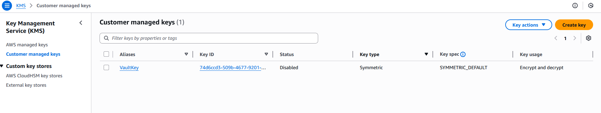
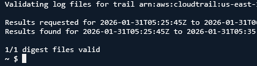
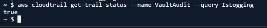

# Hardened Biometric Identity Vault

**Project 2: Serverless Security & Data Sovereignty**

## Overview

A serverless architecture that automates facial analysis for identity verification. This project focuses on enterprise-grade hardening, ensuring data is encrypted with customer-controlled keys and every action is audited for compliance.

## Implementation Guide

### 1. Rapid Infrastructure Recovery

**Action:** Recreate S3 bucket, DynamoDB table, and Lambda function using AWS CLI.

**Rationale:** In production disaster recovery scenarios, manual GUI operations are too time-consuming. CLI-based recovery enables infrastructure restoration within minutes.

**Security Benefit:** High availability and rapid recovery.

### 2. Customer-Managed Key (KMS)

**Action:** Create a Customer-Managed Key (CMK) and configure its key policy.

**Rationale:** AWS default encryption is managed by Amazon. With CMK, you control key rotation, access, and deletion—ensuring data sovereignty.

**Security Benefit:** Data sovereignty. Unauthorized access to S3 data is mitigated without explicit KMS permissions.

**Verification:** Screenshot KMS console showing `VaultKey` with "Enabled" status and Key ID.

### 3. S3 Bucket Encryption

**Action:** Apply bucket encryption policy enforcing encryption with customer-managed KMS key.

**Rationale:** Prevents accidental or unauthorized unencrypted uploads and enforces consistent encryption standards.

**Security Benefit:** Enforced encryption-at-rest.

**Verification:** Run `aws s3api head-object` on a test file to confirm `SSEKMSKeyId` matches your CMK.

### 4. Audit Logging (CloudTrail)

**Action:** Enable CloudTrail and configure it to log to a dedicated, isolated S3 bucket.

**Rationale:** Provides complete visibility of API activity. Records the who, what, where, and when of every action.

**Security Benefit:** Non-repudiation and forensic investigation capabilities.

### 5. Log File Validation

**Action:** Enable CloudTrail log file validation using cryptographic signatures.

**Rationale:** Detects tampering or deletion attempts by advanced adversaries. Signatures prove logs remain unmodified.

**Security Benefit:** Log integrity assurance.

**Verification:** Run `aws cloudtrail validate-logs` and confirm all log files are valid.

## Security Architecture

| Feature | Threat Mitigated | Security Control |
|---------|-----------------|-----------------|
| **KMS CMK** | Unauthorized data access | Cryptographic isolation |
| **CloudTrail** | Insider threats, account takeover | Continuous auditing |
| **Log Validation** | Log tampering, evidence deletion | Cryptographic integrity |
| **IAM Least Privilege** | Lateral movement | Permission hardening |

## Future Enhancements

- **Phase 3:** Integrate GuardDuty to automatically detect unauthorized access attempts
- **Phase 4:** Deploy infrastructure using Terraform for full Infrastructure as Code (IaC) compliance