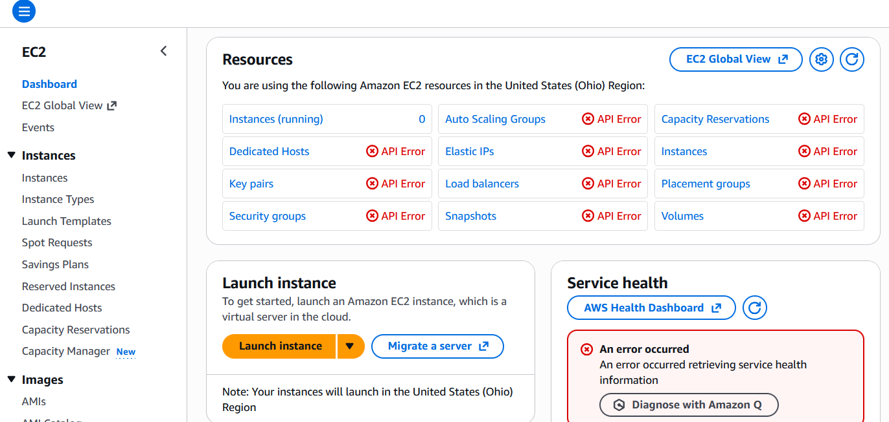
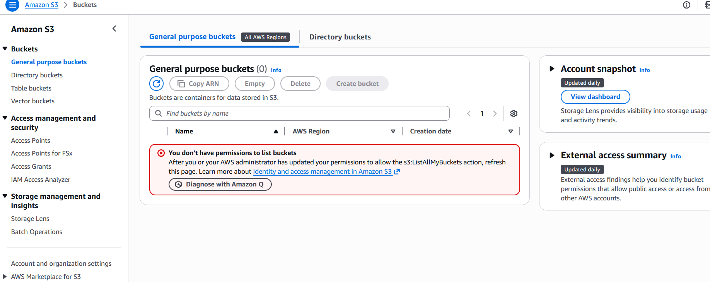
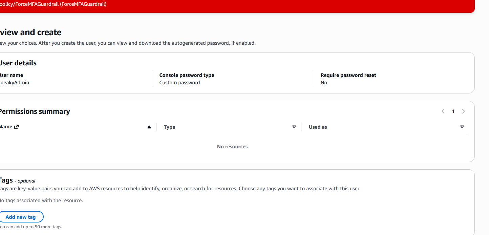

# Identity Governance & Zero-Trust Access Control

**Project:** Hardened Guardrails  
**Focus:** IAM Policy Logic, Context-Aware Security, Privilege Escalation Prevention

## Implementation Overview

### 1. Multi-Factor Authentication Enforcement

Created a Customer-Managed Policy (`ForceMFAGuardrail`) that enforces MFA for all administrative actions using conditional logic.

**Policy Logic:**
- Uses `NotAction` and `Condition` keys to create a deny rule
- Denies all actions when `aws:MultiFactorAuthPresent` is `false`
- Overrides administrator permissions—no exceptions

---

### 2. Enforcement Validation

Verified MFA enforcement by testing with a user account (`test-admin-user`) that has `AdministratorAccess` but no active MFA token. The custom policy successfully blocked all API calls across services.

**Results:**
- EC2 access denied
- S3 access denied
- All administrative actions blocked

---

### 3. Permissions Boundary Enforcement

Implemented Permissions Boundaries to prevent privilege escalation. This mechanism restricts what permissions an administrator can grant to new users or roles, preventing the creation of unrestricted admin accounts.

**Protection:**
- Users and roles can only be created with an assigned Permissions Boundary
- Ensures delegated administration remains controlled
- Prevents creation of unauditable "shadow admin" accounts

---

## Key Concepts

- **Deny-Overrides-Allow:** AWS IAM policy evaluation always grants access only when no explicit deny exists
- **Conditional Logic:** `NotAction` combined with conditions enables granular control beyond standard policies
- **Permissions Boundaries:** Maximum permissions ceiling for delegated administration—even admins cannot exceed boundaries
- **MFA Context:** `aws:MultiFactorAuthPresent` provides cryptographic proof of user identity verification