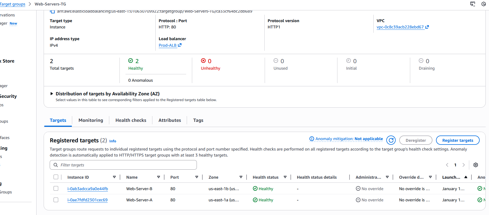
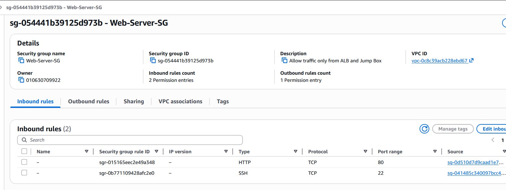
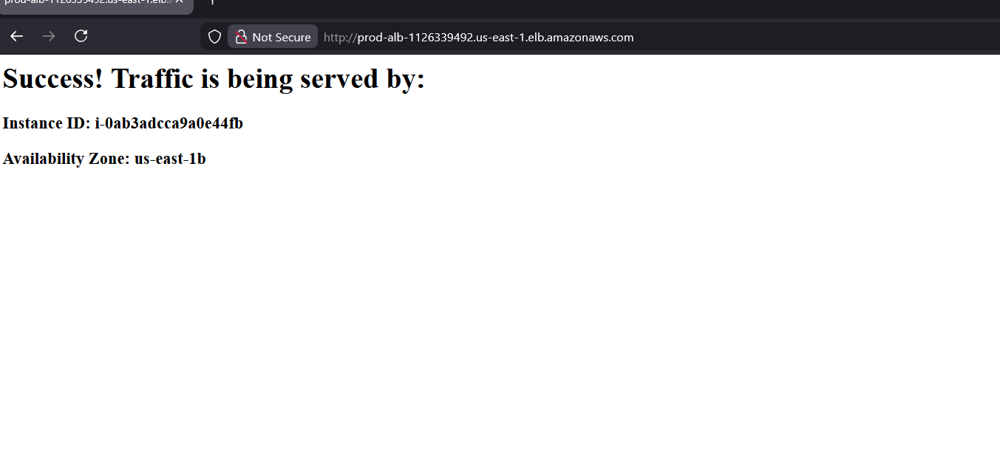

# Lab Day 7: High-Availability Multi-AZ Web Architecture on AWS

## Project Objective

This project demonstrates deploying a highly available, fault-tolerant web application using a two-tier architecture. Web servers are hosted in **Private Subnets** (no direct internet access) and exposed securely via an **Application Load Balancer (ALB)** across multiple Availability Zones (AZs).

## Architecture Overview

The infrastructure uses two public subnets for ingress/egress traffic and two private subnets for protected compute resources.


## Key Components

### 1. Application Load Balancer (Inbound Traffic)

The ALB distributes inbound user traffic across instances. Users access a single DNS name while the ALB routes requests across instances in both public subnets.

- **Traffic Distribution:** Uses round-robin algorithm to distribute traffic between instances
- **Cross-Zone Load Balancing:** Ensures even distribution regardless of which AZ receives the request

### 2. NAT Gateway (Outbound Traffic)

While the ALB handles inbound user traffic, the NAT Gateway enables outbound connectivity for private instances.

- **Secure Updates:** Allows private instances to reach the internet (e.g., download packages via `yum install`) without exposing them directly to inbound internet traffic

### 3. Target Groups & Health Checks

Target Groups continuously monitor instance health and automatically remove unhealthy instances from rotation.



## Security Model: Security Group Chaining

A "Least Privilege" security model enforces security group chaining:

- **ALB Security Group:** Opens Port 80 to the entire internet (`0.0.0.0/0`)
- **Web-Server Security Group:** Restricts inbound HTTP (Port 80) to the ALB's Security Group ID only



## Instance Bootstrap with User Data

A bootstrap script runs at instance launch to ensure consistent configuration. The script uses **IMDSv2** to securely fetch metadata for instance identification.

```bash
#!/bin/bash
yum update -y
yum install -y httpd
systemctl start httpd
systemctl enable httpd

# Fetch metadata securely using IMDSv2
TOKEN=$(curl -X PUT "http://169.254.169.254/latest/api/token" \
  -H "X-aws-ec2-metadata-token-ttl-seconds: 21600")
AZ=$(curl -H "X-aws-ec2-metadata-token: $TOKEN" -s \
  http://169.254.169.254/latest/meta-data/placement/availability-zone)
ID=$(curl -H "X-aws-ec2-metadata-token: $TOKEN" -s \
  http://169.254.169.254/latest/meta-data/instance-id)

# Display server information on the web page
echo "<h1>Success! Traffic is being served by:</h1><h3>ID: $ID</h3><h3>Zone: $AZ</h3>" > /var/www/html/index.html
```

## Troubleshooting

### Issue 1: Private Instances Cannot Reach Internet

**Problem:** Private instances could not install Apache packages, and the target group showed them as "Unhealthy."

**Root Cause:** The private route table contained a blackhole route for `0.0.0.0/0` due to a deleted NAT Gateway.

**Solution:**
1. Provisioned a new NAT Gateway with a corresponding Elastic IP
2. Updated the private route table to point `0.0.0.0/0` to the new NAT Gateway
3. Restarted instances

### Issue 2: ALB Cannot Receive Traffic

**Problem:** AWS displayed a warning that a public subnet lacked a route to the Internet Gateway during ALB creation.

**Solution:**
1. Verified the VPC route tables
2. Identified that the subnet was not associated with the public route table
3. Associated the subnet with the correct public route table
4. ALB successfully received internet traffic

## Verification

High availability was verified by observing traffic distribution across both AZs:




## Summary

This architecture demonstrates:
- **High Availability:** Traffic automatically routes to healthy instances across multiple AZs
- **Secure Networking:** Private subnets isolate compute resources; security groups enforce least-privilege access
- **Automation:** Bootstrap scripts enable consistent, repeatable deployments
- **Observability:** Target groups continuously monitor instance health
