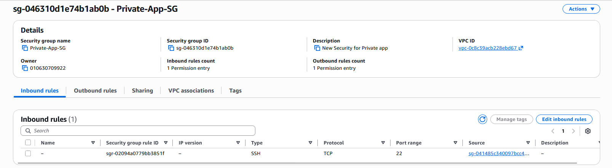
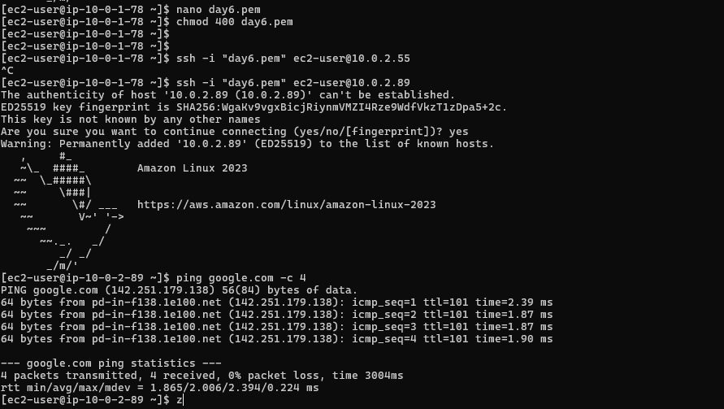

# Day 6: Egress-Only Connectivity & Bastion Hosts (NAT Gateway)

## 📋 Project Overview

Day 6 focused on implementing secure, outbound-only internet connectivity for private subnet resources while maintaining network isolation. This lab demonstrates the use of **NAT Gateways**, **Bastion Hosts (Jump Boxes)**, and **Security Group nesting** to create a production-grade network architecture that follows the Principle of Least Privilege.

---

## 🎯 Objective

To build a secure, production-grade network architecture where:

- Backend servers are isolated from the public internet (no incoming connections)
- Private resources can securely download updates and patches (outbound-only access)
- Access to private resources is controlled through a single authorized entry point (Bastion Host)
- Network security is enforced at multiple layers (Route Tables, Security Groups)
- Identity-based security is implemented through Security Group nesting

---

## 🏗️ Architecture Design

### Network Topology

The architecture implements a **two-tier network** with public and private subnets. The **public subnet** uses an **Internet Gateway** for bidirectional internet access, while the **private subnet** uses a **NAT Gateway** for outbound-only connectivity. A **Bastion Host** provides secure access to private resources.

```
Internet
   │
   ├─→ [Public Subnet] ──→ [Internet Gateway] ←─→ Internet (Bidirectional)
   │        │
   │        ├─→ [NAT Gateway] (Deployed in Public Subnet)
   │        │
   │        └─→ [Bastion Host (Jump Box)]
   │                    │
   │                    └─→ [Private Subnet] ──→ [App Server] (No Public IP)
   │                                                    │
   │                                                    └─→ NAT Gateway (Outbound Only)
```

### Components Created

| Component | Location | Purpose |
| :--- | :--- | :--- |
| **Public Subnet A** | `10.0.1.0/24` | Houses the Bastion Host (Jump Box) |
| **Private Subnet A** | `10.0.2.0/24` | Houses the App Server (No Public IP) |
| **NAT Gateway** | Public Subnet (used by Private Subnet) | Provides one-way outbound internet access for private resources |
| **Elastic IP** | Attached to NAT Gateway | Static public IP for NAT Gateway |
| **Bastion Host** | Public Subnet | Authorized entry point for SSH access |
| **App Server** | Private Subnet | Backend server with no direct internet access |

---

## 🛠️ Implementation

### Step 1: NAT Gateway Setup

#### Configuration

**Deployed:** NAT Gateway in the **Public Subnet** with an **Elastic IP** assignment.

**Purpose:** Acts as a "one-way mirror" allowing private instances to initiate outbound connections to the internet while preventing inbound connections from reaching private resources.

**Key Features:**
- NAT Gateway provides outbound-only connectivity
- Private instances can reach internet (for updates, patches, API calls)
- Internet cannot initiate connections to private instances
- Stateful NAT translation tracks outbound connections

<details>
  <summary><b>Elastic IP Configuration</b></summary>
  <p align="center">
    
    <br>
    <i>Elastic IP assigned to NAT Gateway for static outbound connectivity</i>
  </p>
</details>

### Step 2: Private Route Table Configuration

#### Routing Logic

**Updated:** Private Route Table to include a default route (`0.0.0.0/0`) pointing to the **NAT Gateway**.

**Route Configuration:**
- **Destination:** `0.0.0.0/0` (all traffic)
- **Target:** NAT Gateway
- **Purpose:** Direct all outbound internet traffic from private subnet through NAT Gateway

**Security Benefit:** Private subnet resources can initiate outbound connections but cannot receive unsolicited inbound traffic.

<details>
  <summary><b>Private Route Table Configuration</b></summary>
  <p align="center">
    
    <br>
    <i>Private Route Table showing default route (`0.0.0.0/0`) to NAT Gateway</i>
  </p>
</details>

### Step 3: Security Group Nesting (Identity-Based Security)

#### Implementation Strategy

Instead of opening SSH to the world (`0.0.0.0/0`), implemented **Security Group nesting** for identity-based security:

**Configuration:**
- **Private-App-SG (Private Server):** 
  - Allows inbound SSH (port 22) **only from** `Public-Jump-Box-SG`
  - Source: Security Group ID of the Bastion Host
- **Public-Jump-Box-SG (Bastion Host):**
  - Allows inbound SSH (port 22) from authorized IP (`<MY_IP>/32`)
  - Outbound: All traffic allowed

**Security Benefits:**
- ✅ **Zero Trust:** Private server only accessible through authorized Bastion Host
- ✅ **No IP-based Rules:** Identity-based access using Security Groups
- ✅ **Defense in Depth:** Multiple layers of security (Route Tables + Security Groups)
- ✅ **Audit Trail:** All access goes through a single point (Bastion Host)

<details>
  <summary><b>Private Security Group Rules</b></summary>
  <p align="center">
    
    <br>
    <i>Private Security Group inbound rules showing source as Security Group ID (identity-based access)</i>
  </p>
</details>

---

## ✅ Validation & Testing

### Test 1: Bastion Host Connectivity

**Step 1:** SSH into the Public Bastion Host from local machine

```bash
ssh -i ~/.ssh/security-engine-key ubuntu@<BASTION_PUBLIC_IP>
```

**Result:** ✅ **Success** - Bastion Host accessible from authorized IP

### Test 2: Private Server Access via Bastion (Jump Test)

**Step 1:** Create temporary key file inside Bastion Host
```bash
# Inside Bastion Host
nano /tmp/private_key
# Paste private key content
chmod 600 /tmp/private_key
```

**Step 2:** SSH into Private App Server from Bastion Host
```bash
# Inside Bastion Host
ssh -i /tmp/private_key ubuntu@<PRIVATE_SERVER_IP>
```

**Result:** ✅ **Success** - Private server accessible through Bastion Host only

### Test 3: Outbound Internet Connectivity (NAT Gateway Verification)

**Test:** Verify private server can reach internet for updates

```bash
# Inside Private App Server
ping google.com
```

**Expected Result:** ✅ **Success** - NAT Gateway translating outbound traffic

**Actual Result:** ✅ **Success** - Internet connectivity confirmed

<details>
  <summary><b>Ping Test from Private Server</b></summary>
  <p align="center">
    
    <br>
    <i>Successful ping from private server (`10.0.2.89`) to Google via NAT Gateway</i>
  </p>
</details>

### Test 4: Inbound Traffic Blocking Verification

**Test:** Attempt to reach private server from internet

```bash
# From local machine (outside VPC)
ping <PRIVATE_SERVER_IP>
ssh ubuntu@<PRIVATE_SERVER_IP>
```

**Expected Result:** ❌ **Timeout/Failure** - Private server has no public IP and no inbound route

**Actual Result:** ❌ **Blocked** - Confirmed private server is isolated from inbound internet traffic

<details>
  <summary><b>Ping Test Comparison</b></summary>
  <p align="center">
    
    <br>
    <i>Ping test showing private IP unreachable from public internet, confirming isolation</i>
  </p>
</details>

### Test 5: Security Group Nesting Verification

**Verification:** Confirmed that private server only accepts connections from Bastion Host Security Group

**Result:** ✅ **Verified** - Private server only allows SSH from Bastion Host Security Group

---

## 📊 Security Architecture Comparison

| Security Aspect | Without NAT/Bastion | With NAT/Bastion | Improvement |
| :--- | :--- | :--- | :--- |
| **Private Server Internet Access** | None (no updates possible) | Outbound-only via NAT | ✅ Secure updates enabled |
| **Inbound Attack Surface** | Direct internet exposure | Completely isolated | ✅ 100% protection |
| **SSH Access Control** | IP-based (can change) | Identity-based (SG nesting) | ✅ More secure |
| **Access Point** | Multiple entry points | Single Bastion Host | ✅ Centralized control |
| **Audit Trail** | Distributed | Centralized (Bastion) | ✅ Better compliance |

---

## 🔐 Security Principles Applied

### 1. Principle of Least Privilege
- Private servers only have access to what they need (outbound internet)
- SSH access restricted to authorized Security Group only

### 2. Defense in Depth
- **Layer 1:** Route Tables (network segmentation)
- **Layer 2:** Security Groups (instance-level firewalls)
- **Layer 3:** NAT Gateway (outbound-only connectivity)

### 3. Identity-Based Security
- Security Group nesting uses identity (Security Group ID) instead of IP addresses
- More resilient to IP changes than IP-based rules

### 4. Single Point of Entry
- All access to private resources goes through Bastion Host
- Centralized access control and audit logging

### 5. Zero Trust Networking
- No implicit trust for inbound connections
- Every connection must be explicitly allowed
- Private resources cannot be reached directly from internet

---

## 💡 Key Learnings

### Network Architecture

1. **NAT Gateway:** Enables outbound-only connectivity for private resources, essential for security updates without exposing services
2. **Bastion Host Pattern:** Provides secure, controlled access to private resources while maintaining isolation
3. **Security Group Nesting:** More secure than IP-based rules as it uses identity rather than addresses

### Security Best Practices

1. **Outbound-Only Access:** NAT Gateway pattern allows updates without inbound exposure
2. **Identity-Based Access:** Security Group references are more resilient than IP addresses
3. **Jump Box Architecture:** Single point of access simplifies security management and auditing

### Operational Benefits

1. **Patch Management:** Private servers can download security updates without direct internet exposure
2. **Centralized Access:** All SSH access logs through Bastion Host for compliance
3. **Scalability:** Security Group nesting scales automatically as instances are added

---

## 💰 Cost Optimization & Cleanup

### Resource Cleanup

To maintain Free Tier eligibility and avoid unnecessary costs associated with NAT Gateways and Elastic IPs, the following cleanup was performed:

1. **Terminated EC2 Instances:**
   - Bastion Host (Jump Box)
   - App Server (Private Server)

2. **Deleted NAT Gateway:**
   - Removed NAT Gateway to stop incurring hourly charges

3. **Released Elastic IP:**
   - Released Elastic IP address to prevent charges for unassociated IPs

> **Note:** NAT Gateways incur hourly charges even when not actively used. Always clean up NAT Gateways and Elastic IPs when not in production use.

---

## 🔧 Tools & Technologies

- **AWS VPC:** Virtual Private Cloud infrastructure
- **AWS NAT Gateway:** Managed Network Address Translation service
- **AWS EC2:** Compute instances (Bastion Host, App Server)
- **AWS Elastic IP:** Static public IP addresses
- **AWS Security Groups:** Instance-level firewalls with identity-based access
- **SSH:** Secure Shell for remote access
- **ICMP/Ping:** Network connectivity testing

---

## 🚀 Next Steps

1. **Advanced Security:**
   - Implement VPC Flow Logs for network traffic monitoring
   - Set up AWS Systems Manager Session Manager as Bastion alternative
   - Configure AWS CloudWatch for NAT Gateway monitoring

2. **High Availability:**
   - Deploy NAT Gateway in multiple Availability Zones
   - Implement multiple Bastion Hosts for redundancy
   - Use Auto Scaling for Bastion Host resilience

3. **Automation:**
   - Convert to Infrastructure as Code (Terraform/CloudFormation)
   - Automate Bastion Host key rotation
   - Implement automated security group rule validation

---

## 🔗 Related Resources

- [AWS NAT Gateway Documentation](https://docs.aws.amazon.com/vpc/latest/userguide/vpc-nat-gateway.html)
- [AWS Security Groups Documentation](https://docs.aws.amazon.com/vpc/latest/userguide/security-group-rules.html)
- [Bastion Host Best Practices](https://aws.amazon.com/solutions/implementations/linux-bastion/)
- [AWS Systems Manager Session Manager](https://docs.aws.amazon.com/systems-manager/latest/userguide/session-manager.html)

---

## 📝 Lab Metadata

- **Lab Date:** Day 6
- **Focus Area:** Egress-Only Connectivity & Bastion Host Architecture
- **AWS Services:** VPC, NAT Gateway, EC2, Elastic IP, Security Groups
- **Architecture Pattern:** Jump Box / Bastion Host with NAT Gateway
- **Status:** ✅ Complete

---

**Architecture Pattern:** Bastion Host with NAT Gateway  
**Security Model:** Identity-Based Access with Outbound-Only Connectivity  
**Compliance:** CIS AWS Foundations Benchmark aligned
