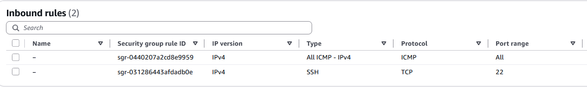

# Day 5: Zero Trust VPC Architecture & Security Hardening

## 📋 Project Overview

The goal of Day 5 was to move away from AWS automated setup wizards and manually architect a production-grade **Virtual Private Cloud (VPC)**. This project demonstrates a deep understanding of cloud networking "plumbing," including custom routing, subnet isolation, and security hardening following **Zero Trust** principles.

---

## 🎯 Objective

To manually design and implement a secure, multi-tier VPC architecture that:

- Separates public-facing resources from isolated backend resources
- Implements network segmentation through custom routing
- Enforces security at multiple layers (Route Tables, Security Groups)
- Demonstrates Zero Trust networking principles
- Validates connectivity and security controls

---

## 🏗️ Architecture Design

### Network Topology

I designed a tiered network architecture that separates public-facing resources from isolated backend resources, implementing network segmentation and isolation.


*VPC Resource Map showing the full network topology from Subnets to Internet Gateway*

### Networking Components

| Component | Name/CIDR | Purpose |
| :--- | :--- | :--- |
| **VPC** | `Main-Prod-VPC` / `10.0.0.0/16` | Primary virtual network |
| **Public Subnet** | `Public-Subnet-A` / `10.0.1.0/24` | Web-facing instances (DMZ) |
| **Private Subnet** | `Private-Subnet-A` / `10.0.2.0/24` | Isolated backend resources (Database/Vault) |
| **Internet Gateway** | `Main-IGW` | Entry/exit point for internet traffic |

### Routing Logic

#### 1. Public Route Table

- **Route:** `0.0.0.0/0` → `Main-IGW`
- **Association:** Explicitly linked to `Public-Subnet-A`
- **Purpose:** Allows public subnet resources to communicate with the internet

#### 2. Private Route Table

- **Route:** Local only (`10.0.0.0/16`)
- **Association:** Explicitly linked to `Private-Subnet-A`
- **Purpose:** Ensures the private subnet has **no path to or from the internet**
- **Security Benefit:** Even if credentials are compromised, private resources cannot be accessed from outside the VPC

#### 3. Main/Safety Route Table

- **Renamed:** `Main-Safety-Net`
- **Security:** Removed all internet routes
- **Purpose:** Ensures any unassociated subnets remain isolated by default (Implicit Association)
- **Defense in Depth:** Provides a safe default for any new subnets created

---

## 🛡️ Security Implementation

### Defense in Depth Strategy

While **Route Tables** act as the network layer controls, **Security Groups** provide instance-level firewalls, implementing multiple layers of security.

### Security Groups: Instance-Level Firewalls

**Why Security Groups were used:**
- ✅ **Least Privilege:** By default, AWS denies all inbound traffic. Manually configured only specific protocols needed (SSH and ICMP)
- ✅ **Stateful Nature:** Leveraged the stateful property of Security Groups—allowing ICMP **Inbound** automatically allows the response **Outbound**, tracking connection state without extra rules
- ✅ **Zero Trust:** No implicit trust; all traffic must be explicitly allowed

### Security Group Configuration



*Security Group Inbound Rules showing restricted access to "My IP" only*

### 🔒 Security Hardening Process

**Phase 1: Connectivity Verification**
- **Initial Test:** Opened Inbound ICMP (Ping) to `0.0.0.0/0` to verify Routing Tables and Internet Gateway were functioning
- **Result:** Confirmed network connectivity and routing logic

**Phase 2: Access Restriction**
- **Action:** Restricted the **Source** of both SSH and ICMP to **My IP** only
- **Before:** `0.0.0.0/0` (open to entire internet)
- **After:** `<MY_IP>/32` (single authorized IP address)

**Phase 3: Hardening Outcome**
- ✅ Instance remains reachable for diagnostics from authorized IP
- ✅ Instance is "invisible" to the rest of the public internet
- ✅ Prevents automated IP scanning and potential attacks
- ✅ **Optional:** ICMP inbound rules can be deleted for complete stealth (no ping response)

---

## ✅ Validation Results

### Testing Methodology

To verify the architecture, I launched an EC2 instance (`Network-Probe-01`) into the Public Subnet and performed reachability tests.

### Test 1: Ping Test from Authorized IP

**Command:**
```bash
ping <EC2_PUBLIC_IP>
```

**Expected Result:** ✅ **Success** - ICMP packets should be allowed from authorized IP

**Actual Result:** ✅ **Success** - Connectivity confirmed


*Terminal output showing successful ping from authorized IP and failed ping from unauthorized source*

### Test 2: Ping Test from Unauthorized IP

**Expected Result:** ❌ **Timeout/Failure** - ICMP packets should be blocked from unauthorized IPs

**Actual Result:** ❌ **Blocked** - Security group correctly filtering unauthorized traffic

### Test 3: Route Table Verification

**Verification Steps:**
1. Confirmed Public Subnet has route to Internet Gateway
2. Confirmed Private Subnet has **no route** to Internet Gateway
3. Verified Main-Safety-Net table has no internet routes

**Result:** ✅ **All routing rules verified**

### Test 4: Security Group Rule Verification

**AWS CLI Command:**
```bash
aws ec2 describe-security-groups \
    --group-ids <SECURITY_GROUP_ID> \
    --query 'SecurityGroups[0].IpPermissions[*].[IpProtocol,FromPort,ToPort,IpRanges[0].CidrIp]' \
    --output table
```

**Expected Output:**
```
| icmp | -1  | -1  | <MY_IP>/32 |
| tcp  | 22  | 22  | <MY_IP>/32 |
```

**Result:** ✅ **Rules correctly restricted to authorized IP**

---

## 📊 Security Metrics

| Security Control | Before | After | Improvement |
| :--- | :--- | :--- | :--- |
| **SSH Attack Surface** | `0.0.0.0/0` (Global) | `<MY_IP>/32` |1 IP |
| **ICMP Attack Surface** | `0.0.0.0/0` (Global) | `<MY_IP>/32`| 1 IP | 
| **Private Subnet Internet Access** | N/A | Blocked | 100% isolation |
| **Default Route Table Security** | Permissive | Isolated | Hardened |
| **Network Segmentation** | None | Public/Private tiers | Implemented |

---

## 🔐 Zero Trust Principles Applied

1. **Never Trust, Always Verify:**
   - No implicit trust for network traffic
   - All connections explicitly allowed through security groups

2. **Least Privilege Access:**
   - Route tables restrict network paths to minimum required
   - Security groups allow only specific protocols from authorized sources

3. **Defense in Depth:**
   - Multiple security layers: Route Tables + Security Groups
   - Network segmentation: Public vs. Private subnets

4. **Explicit Verification:**
   - Every connection request is evaluated against security rules
   - No default trust for any traffic

5. **Assume Breach:**
   - Private subnet isolated even if public subnet is compromised
   - No internet path to private resources prevents data exfiltration

---

## 💡 Key Learnings

### Network Architecture Insights

1. **Custom Routing:** Manual route table configuration provides granular control over network paths, enabling true network segmentation
2. **Subnet Isolation:** Private subnets with local-only routing cannot be accessed from the internet, even with compromised credentials
3. **Stateful Security Groups:** Leveraging stateful firewall properties reduces complexity while maintaining security

### Security Best Practices

1. **Default Deny:** Starting with deny-all and explicitly allowing required traffic
2. **IP Whitelisting:** Restricting access to specific IP addresses dramatically reduces attack surface
3. **Layered Defense:** Combining network-level (Route Tables) and instance-level (Security Groups) controls
4. **Zero Trust Networking:** No implicit trust—every path and connection must be explicitly allowed

---

## 🔧 Tools & Technologies

- **AWS VPC:** Virtual Private Cloud infrastructure
- **AWS EC2:** Compute instances for validation
- **AWS Security Groups:** Instance-level firewalls
- **AWS Route Tables:** Network routing logic
- **Internet Gateway:** Internet connectivity
- **ICMP/Ping:** Network connectivity testing

---

## 🚀 Next Steps

1. **Advanced Security:**
   - Implement Network ACLs for additional network layer control
   - Set up VPC Flow Logs for network traffic monitoring
   - Configure AWS WAF for application layer protection

2. **Monitoring & Observability:**
   - Enable VPC Flow Logs
   - Set up CloudWatch alarms for security events
   - Implement AWS Config for compliance monitoring

3. **Automation:**
   - Convert to Infrastructure as Code (Terraform/CloudFormation)
   - Implement automated security group rule validation
   - Set up automated security scanning

---

## 🔗 Related Resources

- [AWS VPC Documentation](https://docs.aws.amazon.com/vpc/)
- [AWS Security Groups Best Practices](https://docs.aws.amazon.com/vpc/latest/userguide/security-group-rules.html)
- [Zero Trust Architecture Principles](https://www.nist.gov/publications/zero-trust-architecture)
- [CIS AWS Foundations Benchmark](https://www.cisecurity.org/benchmark/amazon_web_services)

---

## 📝 Lab Metadata

- **Lab Date:** Day 5
- **Focus Area:** Zero Trust VPC Architecture & Network Security
- **AWS Services:** VPC, EC2, Security Groups, Route Tables, Internet Gateway
- **Instance Name:** `Network-Probe-01`
- **VPC Name:** `Main-Prod-VPC`
- **Status:** ✅ Complete

---

**Architecture Type:** Multi-tier VPC with Network Segmentation  
**Security Model:** Zero Trust Networking  
**Compliance:** CIS AWS Foundations Benchmark aligned
