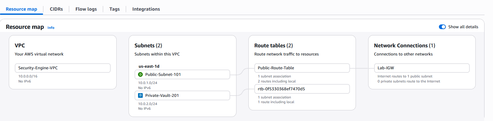

# Day 2: Cloud Networking & VPC Hardening

## 1. VPC Configuration

- **Name:** Security-Engine-VPC
- **CIDR Block:** `10.0.0.0/16`
- **Region:** [e.g., us-east-1]

## 2. Subnet Layout

| Subnet Name | CIDR Block | Type | Purpose |
| :--- | :--- | :--- | :--- |
| Public-Subnet-101 | `10.0.1.0/24` | Public | Web Servers / Bastion |
| Private-Vault-201 | `10.0.2.0/24` | Private | Database / Secrets |

## 3. Connectivity & Security

- **Internet Gateway:** Attached to `Security-Engine-VPC`
- **Public Route Table:** Associated with `Public-Subnet-101`
- **Default Route:** `0.0.0.0/0` → Internet Gateway
- **Private Isolation:** Verified (No route to IGW for Private Subnet)

## 4. Verification

- [x] Verified via VPC Resource Map
- [x] Billing Alarm configured at $0.01

## 5. Visual Evidence

## Reflection

1. **Building a Secure VPC:** To build a VPC for security. Regular Amazon default VPCs allow all resources to have public IPs and access to the Internet Gateway. Custom VPCs only allow what the organization wants—in this case, myself. This implements the Principle of Least Privilege.

2. **Network Segmentation:** Splitting network into `10.0.1.0/24` (Public) and `10.0.2.0/24` (Private) for network segmentation.
   - **Public Subnet:** This is the "DMZ" (Demilitarized Zone). Place resources here that must talk to the internet (like a web server or a gateway).
   - **Private Subnet:** This is the "Vault." By placing databases or internal apps here, they are physically unreachable from the outside world, even if someone steals login credentials. If it's not in the routing table, the traffic cannot find a path to it.

3. **Internet Gateway:** Created and attached an Internet Gateway. Links AWS Internal Network to Public Internet. Now that it is created as a separate object, it can be deactivated in an emergency to save the VPC and stop any data exfiltration.

4. **Custom Route Tables:** Created a new custom route table for the Public Subnet. Private Subnet stays on the Main Route Table and has no route to the Internet Gateway. Even misconfigured servers cannot leak data to public internet.

5. **Security Verification:** Based on Resource Map, there is no link to Private subnet from the Internet. No security holes.

**Summary:** I transitioned the project from a default, insecure network state to a hardened, multi-tier VPC. I implemented network segmentation to isolate sensitive data and used custom routing to ensure that only designated 'public' zones have an internet path, reducing the overall attack surface of the infrastructure.
