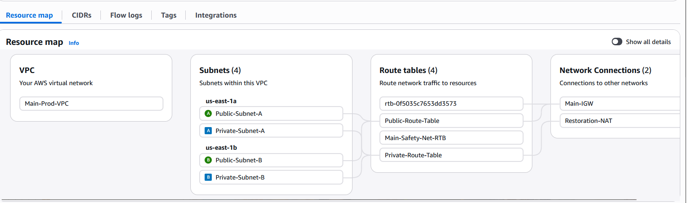
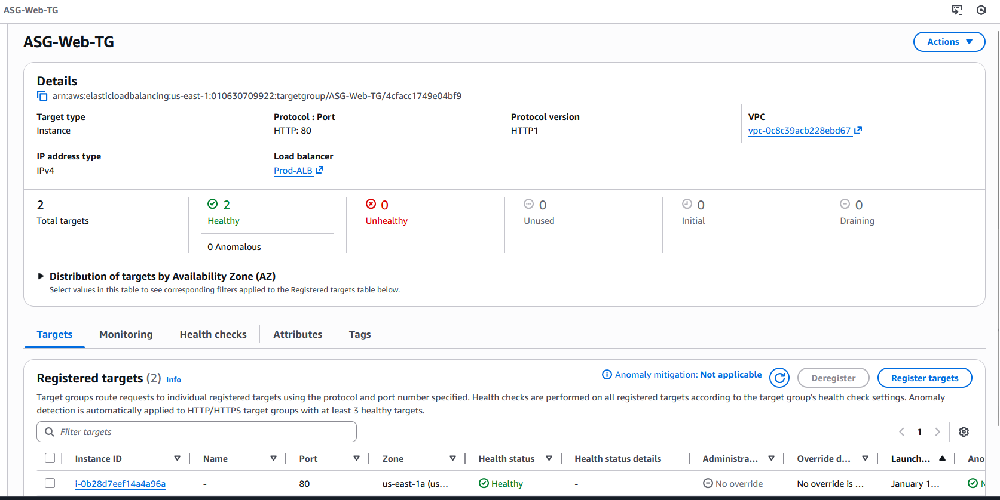
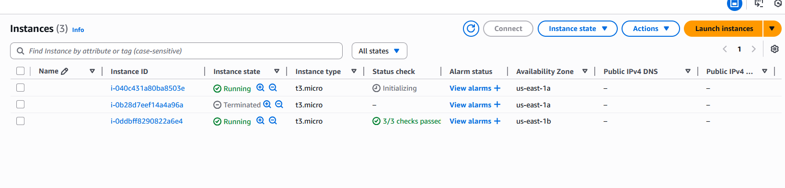
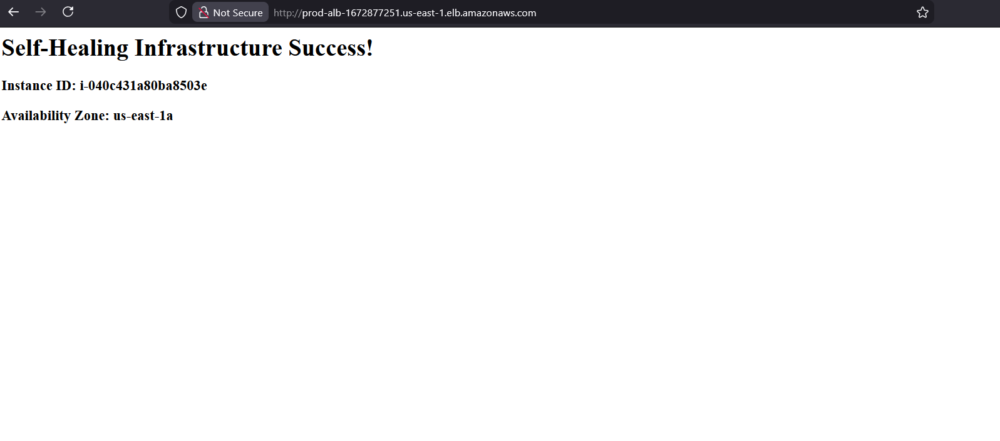
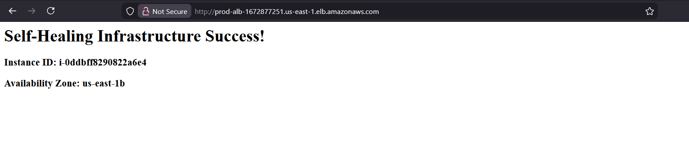

# Day 8: Self-Healing & Scalable 2-Tier Web Architecture

> **Resilient & Scalable Private-Subnet Deployment**

## Overview

This exercise demonstrates the architecture evolution from manual, static infrastructure to fully automated, self-healing cloud environments. By isolating EC2 compute resources in Private Subnets and orchestrating them with Application Load Balancing and Auto Scaling, the architecture maintains high availability and security.

**Key Objective:** Achieve zero-downtime recovery from infrastructure failures through automated detection and remediation.

---

## Architecture Design

### Component Integration
The power of this architecture lies in how the components are linked together:

1. **Application Load Balancer (ALB):** Positioned in Public Subnets, the ALB listens on port 80 for inbound traffic and maintains a health registry of available targets.

2. **Target Group:** Acts as a service registry. The ALB forwards traffic exclusively to instances registered with this group and marked as healthy.

3. **Auto Scaling Group (ASG):** Manages EC2 instance lifecycle. When associated with the Target Group:
   - Automatically registers new instances upon launch
   - Deregisters unhealthy instances
   - Replaces failed instances to maintain desired capacity

---

## Traffic Flow

### Request Lifecycle (End-to-End)

| Step | Component | Action |
|------|-----------|--------|
| 1 | User | Initiates request to ALB DNS endpoint |
| 2 | ALB | Queries Target Group for healthy instances |
| 3 | ALB | Routes traffic to private IP of selected instance |
| 4 | EC2 | Processes request and sends response back through ALB |
| 5 | NAT Gateway | Handles outbound traffic for server updates (e.g., package installations) |

---

## Security Architecture

- **Network Isolation:** EC2 instances operate in Private Subnets with no direct public IP assignment
- **Security Group Chaining:** Instance security group restricts inbound traffic to connections originating from the ALB security group
- **Multi-AZ Resilience:** ASG distributes instances across multiple Availability Zones, automatically recovering capacity in healthy zones during AZ outages

---

## Resilience Validation

### Self-Healing Test

**Procedure:** Manually terminated a healthy EC2 instance  
**Observed Behavior:**
1. Target Group health check detected instance failure
2. ALB stopped routing traffic to the failed instance
3. ASG detected capacity deficit and initiated replacement
4. New instance launched, registered with Target Group, and marked healthy

**Result:** Application remained available throughout failure and recovery with zero manual intervention

---

## Evidence & Screenshots

### 1. VPC Resource Map
Resource configuration showing NAT Gateway with attached Elastic IP for outbound connectivity.

### 2. Target Group Registration
Target Group status showing 2 instances registered and marked as healthy, confirming ALB-ASG communication.

### 3. ASG Activity History
ASG activity logs showing instance termination followed by successful automated launch during the chaos test.

### 4. Application Availability
Website load balancing across multiple availability zones during health verification.

---

## Resource Cleanup

Resources were deleted in the following order to prevent orphaned charges:

1. **Auto Scaling Group** — Halted automated instance management
2. **Load Balancer & Target Group** — Removed public entry point
3. **NAT Gateway** — Eliminated hourly managed service charges
4. **Elastic IP** — Released unattached IP addresses
1.  **Auto Scaling Group** (Stopped the "healing" loop).
2.  **Load Balancer & Target Group** (Removed the entry point).
3.  **NAT Gateway** (Stopped hourly managed charges).
4.  **Elastic IP** (Released to avoid unattached IP fees).