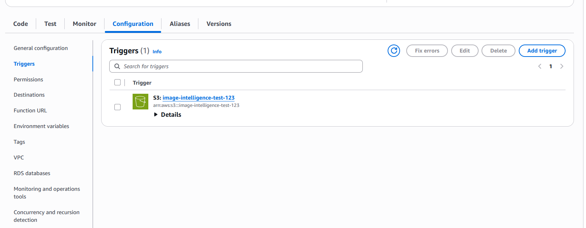
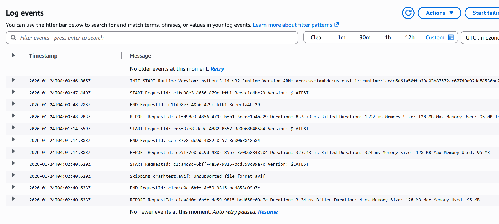
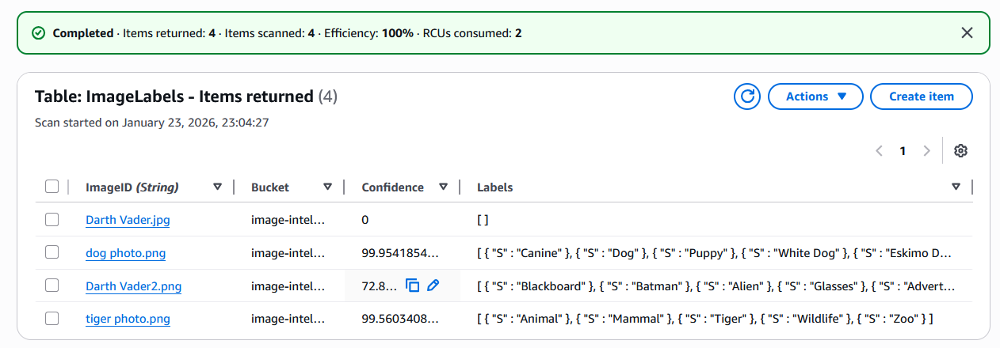

# Day 10: AI-Powered Serverless Image Intelligence

## Objective

Build a fully automated, event-driven data pipeline that uses Artificial Intelligence to detect and categorize images uploaded to the cloud, without managing infrastructure.

## Architecture

- **Storage:** Amazon S3 (Landing Zone)
- **Trigger:** S3 Event Notifications (ObjectCreated)
- **Compute:** AWS Lambda (Python 3.12)
- **AI Service:** Amazon Rekognition (Computer Vision)
- **Database:** Amazon DynamoDB (NoSQL Metadata Store)
- **Logging:** Amazon CloudWatch

## Implementation

### Database Layer (DynamoDB)

Created a NoSQL table named `ImageLabels` with `ImageID` (String) as the Partition Key. This table stores AI analysis results for efficient retrieval.

### Storage Layer (S3)

Configured a private S3 bucket with the following security controls:
- Block All Public Access enabled
- Object Ownership set to Bucket Owner Enforced
- S3 Bucket Key enabled for KMS encryption (optimizes costs while maintaining security)

### Compute Layer (AWS Lambda)

Implemented a Python function with the following features:
- Decodes file names using `urllib.parse.unquote_plus` to handle special characters
- Filters out unsupported formats (AVIF/WebP) to ensure runtime stability
- Invokes Amazon Rekognition with a 50% confidence threshold
- Stores results in DynamoDB with fallback confidence score of "0" for unlabeled images

### Security (IAM)

The Lambda function follows the Principle of Least Privilege with a custom role containing:
- `AmazonS3ReadOnlyAccess`
- `AmazonRekognitionFullAccess`
- `AmazonDynamoDBFullAccess`
- `AWSLambdaBasicExecutionRole` (CloudWatch logging)

## Evidence

### S3 Event Trigger

### CloudWatch Logs

### DynamoDB Results

### Test Images

| Image | Description |
|-------|-------------|
|  | Darth Vader |
|  | Dog |
|  | Tiger |

## Key Learnings

### AI Recognition Limitations

The model identified Darth Vader as Batman (72% confidence) because it prioritizes geometric features (mask, cape, dark colors) over character-specific identification.

### Format Compatibility

Most cloud AI services still require standard formats (JPG/PNG). Modern web formats like AVIF require preprocessing in Lambda for compatibility.

### Cost Optimization

Enabling S3 Bucket Key for KMS encryption reduces API calls by 99% while maintaining security, providing significant cost savings at scale.