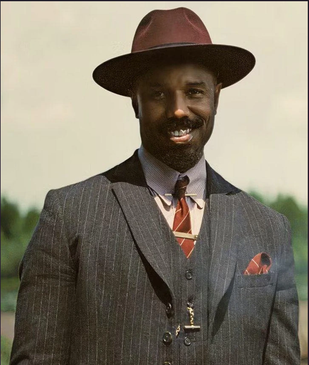

# Identity Vault: Serverless Biometric Authentication

A cloud-native security system that uses **Amazon Rekognition** and **AWS Lambda** to authenticate users based on facial geometry. This project demonstrates how to build a "Biometric Gatekeeper" that can identify authorized personnel and reject intruders using computer vision.

## How It Works

1. **Enrollment**: An authorized user's photo is uploaded to an **Amazon S3** bucket.
2. **Indexing**: A Lambda function triggers Rekognition to extract facial features and store them in a private **Collection**.
3. **Verification**: When a "login" photo is provided, the system compares it against the collection and returns a similarity score.

## Project Evidence

### 1. System Logic & Lambda Configuration

This screenshot shows the core Python logic using `boto3` to bridge S3 and Rekognition.

See the implementation: [day12.py](./day12.py)

### 2. Successful Authentication

The system correctly identifies the authorized user with 100% similarity.


### 3. Intruder Rejection

The vault successfully identifies an unauthorized user (testing Nick Cannon vs. Michael B. Jordan) and denies access.


### 4. Cloud Security (IAM)

The "Least Privilege" configuration allowing the Lambda function to securely access S3 and Rekognition.


### 5. Reference Photos




.png)

## Security Considerations

- **Least Privilege Access**: The Lambda execution role has minimal permissions—only S3 read access and Rekognition operations.
- **Encrypted Storage**: S3 bucket contains sensitive facial data; enable encryption at rest (SSE-S3 or KMS).
- **API Gateway Throttling**: Implement rate limiting to prevent brute-force authentication attempts.
- **No Image Retention**: Rekognition does not store submitted images; only facial geometry is indexed.
- **Collection Privacy**: The Rekognition collection is isolated per environment (dev/prod).
- **Compliance**: Facial recognition systems require user consent and compliance with biometric privacy regulations (e.g., BIPA, GDPR).

## Testing

### Prerequisites
- AWS CLI configured with appropriate credentials
- Python 3.8+ with `boto3` installed
- S3 bucket with sample photos

### Test Scenarios

1. **Collection Creation Test**
   ```bash
   aws lambda invoke --function-name IdentityVault --payload '{"action": "create"}' response.json
   ```

2. **Face Enrollment Test**
   ```bash
   aws lambda invoke --function-name IdentityVault --payload '{"action": "index", "bucket": "your-bucket", "photo": "authorized_user.jpg", "name": "John Doe"}' response.json
   ```

3. **Authentication Success Test**
   ```bash
   aws lambda invoke --function-name IdentityVault --payload '{"action": "search", "bucket": "your-bucket", "photo": "authorized_user_login.jpg"}' response.json
   ```
   Expected: Similarity score > 95%

4. **Intruder Rejection Test**
   ```bash
   aws lambda invoke --function-name IdentityVault --payload '{"action": "search", "bucket": "your-bucket", "photo": "unauthorized_person.jpg"}' response.json
   ```
   Expected: "No Match Found" response

## Troubleshooting

| Issue | Solution |
|-------|----------|
| **"No face detected in the image"** | Ensure the image shows a clear, front-facing face. Rekognition requires proper lighting and face visibility. |
| **Permission Denied error** | Verify the Lambda execution role has `rekognition:*` and `s3:GetObject` permissions. |
| **Collection not found** | Run the Lambda with `action: "create"` first to initialize the collection. |
| **Similarity score too low** | Use photos taken from similar angles/lighting as the enrolled photo. Extreme angles reduce accuracy. |
| **"The image does not contain a valid face"** | Check image quality, resolution, and ensure the face occupies at least 40x40 pixels. |
| **High false positives** | Increase the similarity threshold in the code (default: 90%). Adjust the `FaceMatch` threshold parameter. |
| **S3 access errors** | Confirm the bucket and key names are correct and match the Lambda role permissions. |

## Tech Stack

- **AWS Lambda**: Serverless compute for processing requests.
- **Amazon Rekognition**: Deep learning-based image analysis.
- **Amazon S3**: Secure object storage for user images.
- **Python (Boto3)**: The AWS SDK used to coordinate services.

## Cleanup Instructions

To avoid ongoing AWS costs after finishing the lab, perform the following steps:

### 1. Empty & Delete S3 Buckets

Go to the S3 Console, select your bucket, click **Empty**, then **Delete**.

### 2. Delete the Lambda Function

In the Lambda Console, select your function and click **Actions > Delete**.

### 3. Delete the Rekognition Collection

Since there is no UI for this, run a final test in Lambda with the action `"delete"` (if implemented) or use the AWS CLI:

```bash
aws rekognition delete-collection --collection-id office-employees
```

### 4. Remove IAM Roles

Delete the `IdentityVaultRole` created during the lab to keep your IAM environment clean.