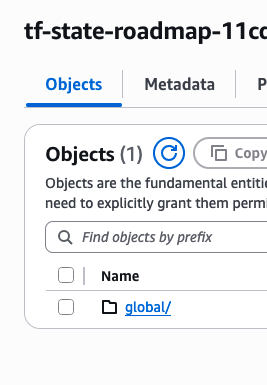
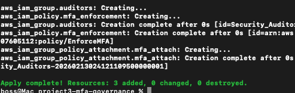
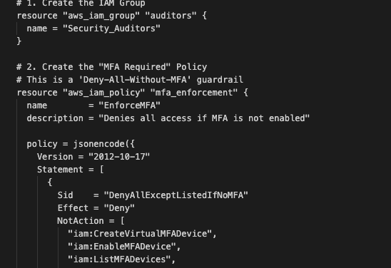
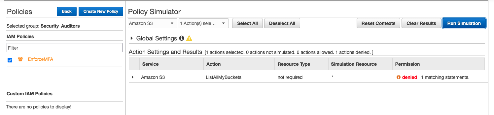

# Day 16: Remote State Migration & IAM MFA Governance 🛡️

## 🎯 Project Vision

Infrastructure as Code (IaC) is only as secure as the **State** it manages. On Day 16, I transitioned from a risky local state model to a professional **Remote Backend** architecture. Simultaneously, I deployed a high-assurance IAM Governance policy to enforce **Multi-Factor Authentication (MFA)** across the environment.

---

## 🏗️ The Architecture: "The Vault & The Gatekeeper"

### 1. The Remote Backend (S3 + Versioning)

We established a **Source of Truth** in the cloud. By moving the `terraform.tfstate` file from a local laptop to an S3 bucket, we achieved:

| Benefit | Description |
|---|---|
| **Durability** | S3 Versioning ensures that if a state file is corrupted, we can perform a "Point-in-Time" recovery. |
| **Security** | State files often contain sensitive metadata. We applied **AES-256 Server-Side Encryption** to protect data at rest. |
| **Persistence** | The "Bootstrap" bucket acts as the permanent anchor for all future 180 days of infrastructure. |

### 2. MFA Governance Policy (Zero Trust)

I authored an IAM policy designed to prevent unauthorized access even if a password is compromised.

- **Logic:** An `Explicit Deny` that triggers if the `aws:MultiFactorAuthPresent` condition is `false`.
- **Self-Service Loop:** Included specific `Allow` statements for IAM MFA actions, ensuring users can set up their own devices without needing an admin to unlock them.

---

## 🛠️ Implementation Deep-Dive

### Step 1: The State Migration

I configured the `backend.tf` to point to the "Global Bootstrap" bucket created on Day 15.

```bash
terraform init -migrate-state
```

**Technical Outcome:** Terraform initialized the S3 backend, compared the local state to the cloud, and uploaded the "memory" of the bootstrap bucket into the bucket itself.

> **S3 State Objects after migration:**



---

### Step 2: Coding the MFA Guardrail

The `main.tf` in the `project3-mfa-governance` folder defined the following:

- **IAM Group:** `Security_Auditors` — to demonstrate group-based access control.
- **IAM Policy:** A JSON-encoded document enforcing MFA.

> **Terraform Build Output:**



> **MFA Policy Document in AWS Console:**



---

## 🧪 Security Audit & Verification

To prove the security controls were effective before tearing down the lab, I used the **AWS IAM Policy Simulator**:

| Parameter | Value |
|---|---|
| **Context** | Simulated a user within the `Security_Auditors` group |
| **Action** | Attempted `s3:ListAllMyBuckets` |
| **Variable** | Set `aws:MultiFactorAuthPresent` to `false` |
| **Result** | ❌ **DENIED** |

**Success Criteria:** The policy successfully blocked access, proving the "Gatekeeper" logic works.

> **Policy Simulation Result:**



---

## 📊 Knowledge Synthesis: "Why the Bootstrap Bucket?"

Even though we destroy the lab projects (like the MFA group) every night to stay within the AWS Free Tier, the **Bootstrap Bucket remains**. It is the "Flight Recorder" of the account.

- **Ancestry** — It tracks the full history of the project.
- **Zombie Prevention** — It prevents orphaned AWS resources with no state file to manage them.
- **Locking** — It provides the locking mechanism required for professional cloud teams.

---

## 🧹 Cleanup Log

| Action | Detail |
|---|---|
| **Resource Destruction** | `terraform destroy` executed in `project3-mfa-governance` |
| **State Integrity** | Confirmed `global/bootstrap/terraform.tfstate` remains in S3 |
| **Cost Impact** | **$0.00** — All resources utilized were Free Tier eligible |
