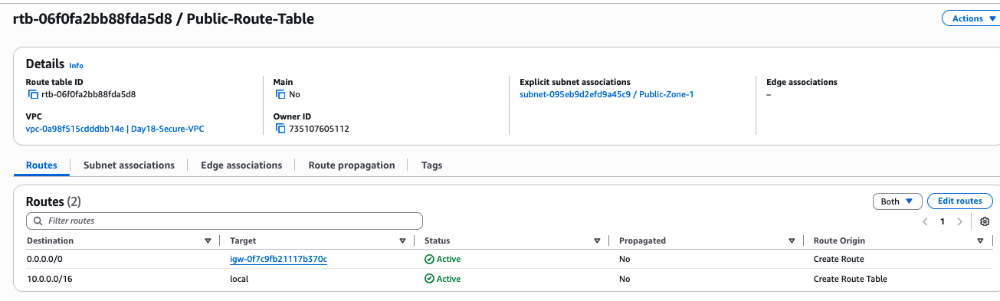
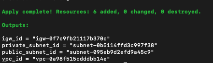
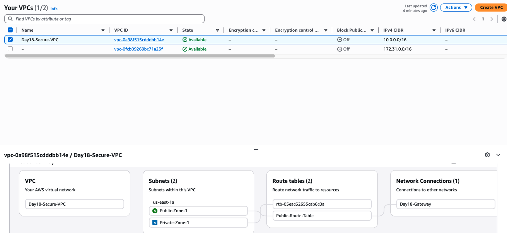

# Day 18: Network Segmentation & DMZ Strategy
**Date:** February 15, 2026  
**Phase:** Phase 2 (Infrastructure as Code — Terraform)  
**Project:** 04 (Secrets Manager & Network Evolution)

---

## Objective
To evolve the basic VPC from Day 17 into a production-ready, segmented network architecture. The goal was to implement "Defense in Depth" by physically and logically separating public-facing entry points from private backend resources — all managed through Infrastructure as Code.

---

## Architecture: Public DMZ & Private Subnet

### Network Topology

| Component | CIDR / Detail | Purpose |
|---|---|---|
| **VPC** | `10.0.0.0/16` | The isolated cloud network boundary |
| **Public Subnet** | `10.0.1.0/24` (us-east-1a) | DMZ — Web servers, load balancers, internet-facing resources |
| **Private Subnet** | `10.0.2.0/24` (us-east-1a) | Vault — Databases, application logic, secrets |
| **Internet Gateway** | Attached to VPC | Controlled exit/entry point for the VPC |
| **Public Route Table** | `0.0.0.0/0` → IGW | Grants internet access *only* to the Public Subnet |

### Design Principle
The Private Subnet has **no route** to the Internet Gateway. It uses the VPC’s default "Main" Route Table, which only contains the local route (`10.0.0.0/16`). This creates a network-level air gap — even if credentials are compromised, private resources cannot be reached from the public internet.

---

## Security Engineering Highlights

1. **Network Air-Gapping:** The Private Subnet was created without a route to the Internet Gateway, making it unreachable from the public web.
2. **Explicit Routing:** Instead of using the "Main" Route Table for public resources, a dedicated **Public Route Table** was created to ensure that only designated subnets have `0.0.0.0/0` access.
3. **Principle of Least Privilege (Network):** Resources are placed in the most restrictive zone by default. Public IP mapping is only enabled on the Public Subnet via `map_public_ip_on_launch = true`.
4. **Terraform Outputs:** Exported all critical resource IDs (`vpc_id`, `public_subnet_id`, `private_subnet_id`, `igw_id`) for cross-project reference and auditability.

---

## Evidence of Deployment

### 1. The Network Resource Map
*This visual proves the logical separation between the internet-connected zone and the isolated zone.*



### 2. Infrastructure as Code Execution
*Proof of successful Terraform automation and resource provisioning.*



### 3. Routing Table Verification
*Technical proof that the `0.0.0.0/0` route exists only on the Public Route Table, pointing to the Internet Gateway.*



---

## Implementation

### IaC Resources Deployed

The `main.tf` defined six resources following a layered approach:

| # | Resource | Terraform Type | Role |
|---|---|---|---|
| 1 | VPC | `aws_vpc` | Network boundary |
| 2 | Internet Gateway | `aws_internet_gateway` | Internet access point |
| 3 | Public Subnet | `aws_subnet` | DMZ zone |
| 4 | Private Subnet | `aws_subnet` | Isolated vault zone |
| 5 | Public Route Table | `aws_route_table` | Internet routing for public zone only |
| 6 | Route Table Association | `aws_route_table_association` | Links public subnet to public route table |

### Terraform Outputs

```
vpc_id             = "vpc-0a98f515cdddbb14e"
public_subnet_id   = "subnet-095eb9d2efd9a45c9"
private_subnet_id  = "subnet-0b5114ffd3c997f38"
igw_id             = "igw-0f7c9fb21117b370c"
```

---

## Commands Used

```bash
# Initialize providers and backend
terraform init

# Preview the infrastructure changes
terraform plan

# Deploy the segmented network architecture
terraform apply -auto-approve

# Verify outputs
terraform output

# Cleanup to protect AWS Credits
terraform destroy -auto-approve
```

---

## Verification Checklist

| Check | Method | Result |
|---|---|---|
| VPC created with correct CIDR | AWS Console / `terraform output` | `10.0.0.0/16` |
| Public Subnet has public IP mapping | Console → Subnet settings | `map_public_ip_on_launch = true` |
| Private Subnet has NO public IP mapping | Console → Subnet settings | Disabled |
| Public Route Table routes to IGW | Console → Route Tables → Routes | `0.0.0.0/0` → `igw-*` |
| Private Subnet uses Main RT (no IGW) | Console → Route Tables | Local route only |

---

## Security Architecture Comparison

| Aspect | Flat Network (Before) | Segmented DMZ (After) |
|---|---|---|
| **Subnet Isolation** | Single subnet, all resources co-located | Public/Private separation |
| **Internet Exposure** | All resources potentially internet-facing | Only Public Subnet has IGW route |
| **Default Posture** | Permissive | Deny-by-default (Private Subnet) |
| **Blast Radius** | Full network compromise | Contained to compromised zone |

---

## Cleanup Log

| Action | Detail |
|---|---|
| **Resource Destruction** | `terraform destroy -auto-approve` executed in `project4-secrets-manager` |
| **State Integrity** | Confirmed `global/bootstrap/terraform.tfstate` remains in S3 |
| **Cost Impact** | **$0.00** — No NAT Gateways, Elastic IPs, or compute instances deployed |
