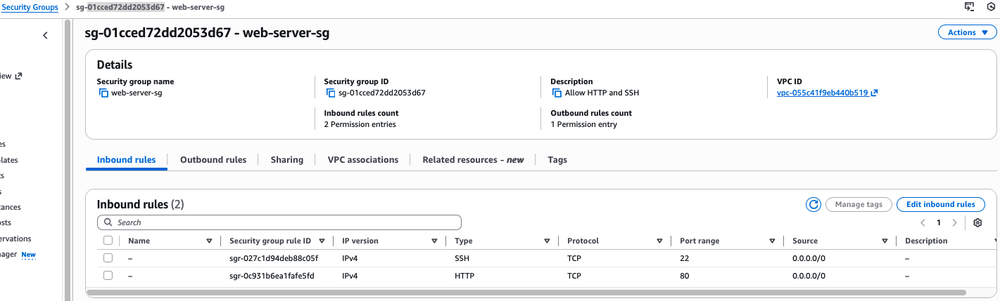

# Day 19 — Layered Defense: Security Groups vs Network ACLs

**Date:** February 16, 2026  
**Phase:** Phase 1 — Secure Networking & Identity  
**Project:** 04 — Network Evolution

## Objective

Implement a defense-in-depth firewall strategy by applying traffic filtering at two layers: the subnet boundary (Network ACLs) and the instance level (Security Groups). This exercise demonstrates how stateless and stateful controls complement each other in AWS VPC security.

## Architecture

**Network ACLs (Layer 1)** are subnet-level, stateless filters applied to all traffic entering or leaving a subnet. Because they do not track connection state, return traffic must be explicitly permitted using ephemeral port ranges.

**Security Groups (Layer 2)** are instance-level, stateful filters applied to ENIs. They automatically permit return traffic for allowed inbound connections, enabling simpler rule definitions.

## Implementation

### Security Group Configuration
A security group was created with:
- **Inbound rules:** HTTP (80) and SSH (22) from specified sources
- **Outbound rules:** All traffic allowed, enabling outbound updates and connection establishment

### Network ACL Configuration
A network ACL was associated with the public subnet with:
- **Rule 100:** Allow inbound HTTP (80)
- **Rule 200:** Allow inbound SSH (22)  
- **Rule 300:** Allow inbound ephemeral ports (1024–65535) to handle return traffic for outbound connections initiated by instances

## Deployment Evidence

### Security Group Inbound Rules

### Network ACL Rules

### Terraform Apply Output

## Key Learnings

- **Ephemeral Port Ranges:** Stateless NACLs require explicit rules to allow return traffic on ports 1024–65535. Omitting this is a common cause of unexpected connectivity issues.
- **Rule Numbering:** NACL rules are evaluated in numeric order. Using gaps between rule numbers (100, 200, 300 instead of consecutive) preserves space for future deny rules.
- **Stateful vs. Stateless:** Security Groups simplify rule logic by automatically handling return traffic, while NACLs provide an additional perimeter filter for defense in depth.
- **Infrastructure as Code:** Automating these configurations with Terraform ensures consistency and auditability.

## Cleanup

**Resources Created:** 1 VPC, 2 Subnets, 1 Internet Gateway, 1 Security Group, 1 Network ACL  
**Cost:** Covered by AWS Free Tier  
**Cleanup:** `terraform destroy` executed to remove resources