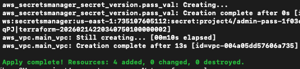
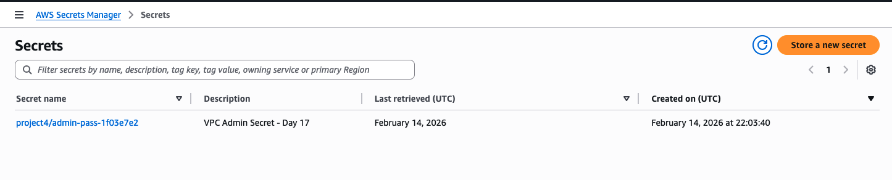

# Project 4: Secure Networking Foundation & Secrets Management

**Date:** February 14, 2026  
**Phase:** Phase 1 (Secure Networking & Identity)  
**Status:** Completed  

---

## 🎯 Overview

This project established the secure networking baseline for our cloud environment. We deployed a private network (VPC) and a secure credential vault simultaneously to ensure "Security by Design" using Infrastructure as Code.

## 🛠️ Tech Stack

| Component | Technology |
|-----------|------------|
| **Cloud** | AWS |
| **IaC** | Terraform (HCL) |
| **Services** | VPC, Secrets Manager, S3 (Remote State) |

---

## 🔐 Security Key Accomplishments

1. **Network Isolation:** Deployed a VPC with a `10.0.0.0/16` CIDR block. Verified that the **Main Route Table** remains internal-only, preventing unauthorized internet exposure.
2. **Zero-Hardcoding Credential Management:** Integrated AWS Secrets Manager to store administrative passwords.
   - Used `recovery_window_in_days = 0` for cost-optimization and instant cleanup.
   - Implemented a secret-versioning strategy to link metadata and content.
3. **State Security:** Leveraged the S3 Remote Backend (created in Day 14) to store the infrastructure state file securely, protecting sensitive metadata from local exposure.

---

## 📸 Screenshots

### Terraform Automation Output


### VPC Resource Map


### Secrets Manager


---

## 🚀 Deployment Instructions

```bash
# Initialize the project and providers
terraform init

# Review the security plan
terraform plan

# Deploy the secure infrastructure
terraform apply -auto-approve
```

---

## 🔍 Verification

- **Secrets Check:**
  ```bash
  aws secretsmanager get-secret-value --secret-id <SECRET_NAME>
  ```
- **VPC Check:** Verify the `Day17-Secure-Network` tag in the VPC Dashboard.

---

## 💰 Cost Management (AWS Free Tier)

| Service | Cost |
|---------|------|
| **VPC** | $0.00 (No NAT Gateways or Public IPs used) |
| **Secrets Manager** | Within the 30-day Free Trial period |
| **State (S3)** | Minimal usage within Free Tier limits |